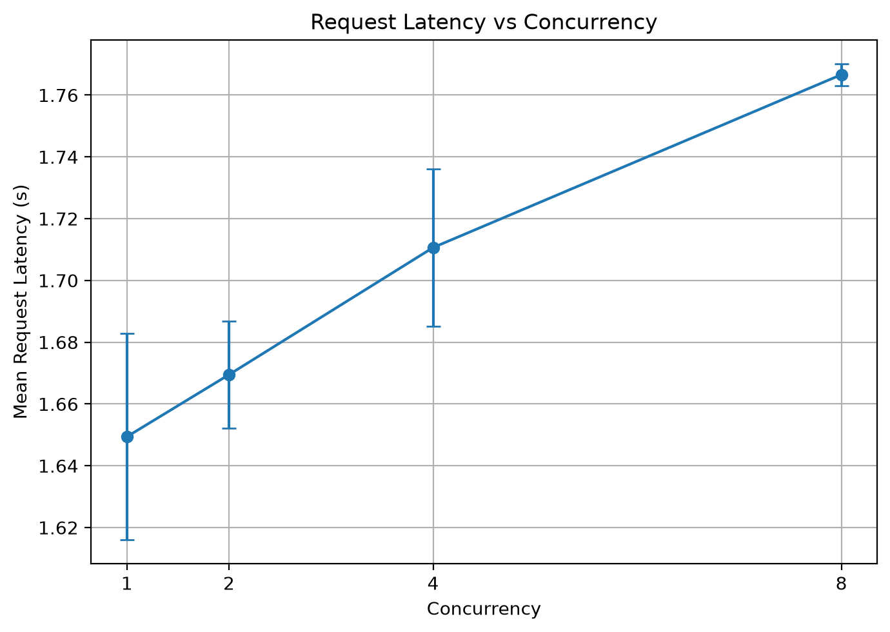
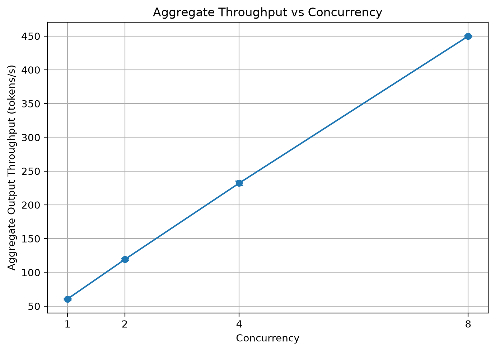

# LLM Inference Perf Lab

Small lab for measuring LLM inference latency on a local or Colab GPU using an OpenAI-compatible vLLM endpoint.

## Layout

```text
llm-inference-perf-lab/
├── notebooks/
│   ├── client_colab.ipynb   # Colab: serve + client + latency sweeps
│   └── vllm_setup.ipynb     # Colab vLLM install / serve helper
├── src/
│   └── client.py            # Minimal OpenAI-compatible client
├── plots/
│   ├── latency_vs_concurrency.png
│   └── throughput_vs_concurrency.png
├── results/
│   └── run_YYYY-MM-DD/      # Dated benchmark artifacts
├── requirements.txt
└── .gitignore
```

## Quick start (Colab)

1. Open `notebooks/client_colab.ipynb` in Google Colab with a GPU runtime.
2. Run cells top to bottom: install → start vLLM → wait until ready → client requests.
3. Section 10 writes a latency sweep CSV with per-request token usage.

Local helper client:

```bash
pip install -r requirements.txt
python src/client.py
```

Point `BASE_URL` / `MODEL_NAME` in `src/client.py` at your OpenAI-compatible server.

## First T4 benchmark

The first experiment was run on a Google Colab Tesla T4 using vLLM 0.11.2
and Qwen2.5-1.5B-Instruct.

Configuration:

- Prompt tokens: 36
- Maximum output tokens: 100
- Temperature: 0.0
- Warmup requests: 1
- Measured requests: 5

Results:

- Mean end-to-end latency: 2.521 s
- Sample standard deviation: 0.204 s
- Minimum latency: 2.200 s
- Maximum latency: 2.702 s
- Streaming TTFT: 0.079 s

Standard deviation is the sample standard deviation across the five measured runs.

The first standalone non-streaming request took 4.887 seconds, substantially
longer than the later sweep requests. This may reflect first-run, runtime-state,
or other transient overhead, but the cause was not isolated in this experiment.

Artifacts: [`results/run_2026-07-12/`](results/run_2026-07-12/) (`latency_raw.csv`, `summary.md`).

## Concurrency sweep (T4)

Same Colab T4 + Qwen2.5-1.5B-Instruct setup. Concurrent request levels
`1, 2, 4, 8`, each repeated three times (36 prompt tokens, 100 max output
tokens, temperature 0.0).

| Concurrency | Mean latency (s) | Aggregate output tokens/s | Scaling efficiency |
|---:|---:|---:|---:|
| 1 | 1.649 | 60.63 | 100.0% |
| 2 | 1.669 | 119.13 | 98.2% |
| 4 | 1.711 | 232.21 | 95.8% |
| 8 | 1.767 | 449.82 | 92.7% |

Mean request latency rose ~7.1% from concurrency 1→8, while aggregate
output throughput improved ~7.42×.





Artifacts: [`results/concurrency_raw.csv`](results/concurrency_raw.csv),
[`results/concurrency_summary.csv`](results/concurrency_summary.csv),
[`plots/`](plots/).

## Metrics notes

- `output_tokens_per_s` / `output_tokens_per_e2e_s` means `completion_tokens / end_to_end_latency`.
  That rate includes prefill, scheduling, and HTTP overhead; it is not pure decode throughput.
- Prefer recording actual `response.usage` token counts on every request; do not assume
  `completion_tokens == max_tokens`.
